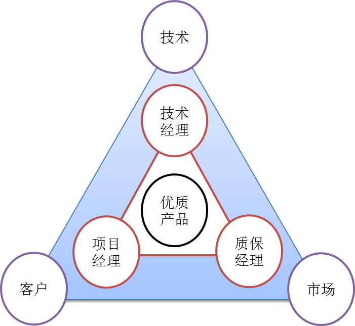

# 软件项目与知识团队管理基础
{:.no_toc}

* 目录
{:toc}

## 1、软件项目管理预备知识

### 1.1 项目与项目管理概念

项目与项目管理：

> **Project management** is the _practice_ of initiating, planning, executing, controlling, and closing the work of a team to achieve _specific goals_ and meet _specific success criteria_ at the _specified time_.  
> A **project** is a _temporary_ endeavor designed to produce a _unique_ product, service or result with a defined beginning and end (usually time-constrained, and often constrained by funding or staffing) undertaken to meet unique goals and objectives, typically to bring about _beneficial change or added value_.   
> 
> --- Nokes, Sebastian _The Definitive Guide to Project Management_ 

项目管理和软件工程类似，（[PMI](https://en.wikipedia.org/wiki/Project_Management_Institute)）按时间轴将项目的生命周期分为五个阶段，按项目管理内容分为10个知识域，即 [PMBok](https://en.wikipedia.org/wiki/Project_Management_Body_of_Knowledge)。

一个重要的问题，**软件项目管理是否要系统的学习项目管理知识？** 令人欣慰的是软件工程在管理域知识与项目管理知识的许多内容是一致的。

> The PMBOK Guide is process-based, meaning it describes work as being accomplished by processes. This approach is consistent with other management standards such as ISO 9000 and the Software Engineering Institute's CMMI. 

### 1.2 认识项目的工期、范围、质量和预算

项目的首要约束是 **scope, time, quality and budget** 四个基本元素，也称为[项目管理三角模型](https://en.wikipedia.org/wiki/Project_management_triangle)。一个项目合约，即是关于四个元素在 **理论** 上精确的约定。项目管理的任务就是优化调度资源使得这些约束得以满足，且最低的成本。

在实际软件项目中，即使在有明确的软件开发合同条件下，这四个约束并不是不可商量的。原因在于软件生产是易变、不可见、独特的智力生产！因为我们并不能如生产肥皂、衣服一样先给一个样品参考标准，甚至在项目开完成也无法写出完善的软件需求规格说明书。已 word 为例，设计师并不完全知道客户真需要什么，会在哪些场景中使用它，除了等待客户反馈，迭代升级，别无其他的方法。

从提升客户满意度的角度，了解并控制这四个元素就是 **软件项目成功的关键**。 

* 工期，软件项目刚性约束。多数情况下，软件的按时投产意味着收益或成本降低
* 预算，软件项目重要约束。它与工期一样，最容易观察与度量，所以没有特别情况也不宜超预算
* 质量，软件质量通常是有底线的。一些指标如可靠性、性能等，比较难以商量；另一些指标如易用性似乎相对灵活，但用户满意度对此特别敏感
* 范围，在多数情况下，客户与开发者能就项目的 20% 内容给出严格的需求约定，80% 的内容都是相对模糊的。因此，围绕客户目标，发现并满足客户感兴趣的内容是最关键的。以 Office 产品为例，早期的版本的功能没有现在版本的 1% ，但这并不会妨碍它的成功。在当年并没人预见到 Office 会有如此多功能，使用者也不会因罗列诸多功能的产品感兴趣，感兴趣的往往是当时背景下最能创造价值的几个特性。

Scope = Time × Resources，在项目管理中称为 STR 模型。

由于软件本身的复杂性、不可见性、不一致性、可变性，软件范围多数情况下对于客户和开发者都是模糊的，这形成软件产品与其他产品不同的开发过程。因此，范围管理是软件项目管理的重中之重！（软件内在本质固然是软件危机的根源，同时也带来开发管理的特色，产品设计与开发者有更大的话语权，这是双刃的！）

软件工程语录：“**先做到，再做好！**”。砍去一些客户都没思考清晰的业务，永远是对的。

### 1.3 2/8 法则在软件项目中的应用

软件工程是软件项目开发、运维与维护过程中最佳实践的总结，关注的都是常见场景的关键工作方法，掌握 20% 软件工程基础知识有助于提升 80% 项目的效率和质量。

项目是综合性的任务，2/8法则会在许多地方用上，如需求获取，软件测试等方面。以软件测试为例，所谓完备的测试并不存在，2/8法则就必须发挥作用了，这是你必须正确定义 20% 测试，它会给你 80% bug 发现做回报！

细化 20% 有效需求，可满足 80% 客户需要，20% 测试可发现 80% BUG。正确发现并做好这 20% 正确的事情，需要熟练的业务能力、敏锐的观察能力、果断的执行能力，排除干扰，才意味着你的团队将以更少的付出、更短的周期获取跟多的客户，在残酷的竞争中获取领先位置。

其他一些有趣的2/8法则：

1. 80%的工程量用在20%的需求上
2. 80%的开发成本花费在20%的部件上
3. 80%的错误是由20%的部件引起的
4. 80%的延期或返工是由20%的变更造成的
5. 80%的系统资源是由20%的部件消耗的
6. 80%的进度是由20%的人完成的

## 2、软件团队管理基础

### 2.1 不能向训练猴子一样管理程序猿 

人，软件工程项目中最重要、也是最活跃的的资源。软件项目管理的一个重要方面的人力资源的组织、分配、以及绩效的评价。在 CMM 中，CMU 的专家们针对软件工程师也有一套模型:  叫 [Personal Software Process (PSP)](http://www.cnblogs.com/xinz/archive/2011/10/22/2220872.html), 对软件团队则有 Team Software Process（TSP）。

软件团队是软件生产的基本单元。现代软件生产，除了软件工程师素养外，团队的组织与管理需要回答很多问题，例如：

* 团队规模多大合适？
* 软件团队有哪些角色，如何配比？
* 什么样的人合适做项目负责人？
* 团队如何确定、分配开发任务？
* 如何度量个人的贡献

软件生产以智力劳动为主，即 **消耗脑浆编写代码**。智力劳动的度量远远复杂与体力劳动，这导致软件生产管理活动依赖太多的表格，如 CMMI 的 [PSP2.1](https://wenku.baidu.com/view/6e1d31d380eb6294dd886c0a.html) ，这导致了软件规范执行难。人们渐渐发现，软件的本质是写代码而不是花大量时间做管理活动，特别是核心程序员，需要的是配程序员鼓励师（愚人节幽默），而不是让他填表。如何在代码生产与管理成本之间取得均衡才是管理难题。

> 关于每日例会的思考  
>   
> 许多软件开发方法都会建议"每日例会"。你是否联想到理发店店长带领店员做早操，或饭店服务员在店门口晨课，手拉手喊“XXX”。对于以创新为中心的团队，公司和团队为帮助核心骨干减压烦白了头，建咖啡厅、食堂、健身房等等。反之早晨训话，晚上填工作小结，估计程序是编不好了啊！另一方面，"每日例会"在软件发布阶段是软件工程最佳实践之一。

### 2.2 知识分子管理的**艺术**

软件团队是知识型团队（学习型团队）要管理好这样的团队，建议首先阅读：

彼得·德鲁克 _[卓有成效的管理者](https://book.douban.com/subject/4020857/)_ 【书评：[领导的秘密](https://book.douban.com/review/1432597/)】 
推荐电影：黄渤导演的[《一出好戏》](https://movie.douban.com/subject/26985127/)

**1、知识的权威**

* 知识工作者依靠自己的知识的力量成为企业的”管理者”（不一定需要管理的职位）。例如，一个外科大夫，他的知识与能力会影响一个团队的运作与效率。
* 现代团队通常是由不同领域知识的个体组成，这些个体之间的关系是平等的

**2、管理时间**

* 知识分子的时间必须由其自己把握的
* 个人必须学会自己记录时间、管理时间、统一安排可以自由支配的时间，使自己的工作卓有成效。
* 人与人沟通是有成本的，团队越大，沟通成本越高，则自己可掌握的时间越少，效率越低。

**3、重视贡献**

* 贡献是外部可感知的成果。例如在软件项目中一个具体的设计、可运行的demo、测试的报告等。
* 个人必须承偌贡献，并在一个合理的时段内呈现结果.它是可度量的
    - 有利于及时发现问题，避免发生重大错误
    - 有利于个人或团队绩效的持续改进

**4、发挥所长**

* 有效的管理者应注重用人之长处，而不介意其缺点
* 不问“他能跟我合得来吗?”而问“他贡献了些什么?”
* 不问“他不能做什么?”而问：“他能做些什么?”

**5、要事优先**

* 成效的管理者总是把重要的事情放在前面先做（first things first），一次做好一桩事情（do onething at a time）

### 2.3 软件团队管理实践

敏捷软件团队，是德鲁克知识团队管理思想的应用。

* 按知识结构组织团队
* 控制团队规模，减低沟通成本
* 协同管理任务
* 按特长设定岗位

它显著的特征是 **自我组织、自我管理**，构建为了共同目标，地位平等、尊重专业、相互学习、执行高效的团队。

**1、敏捷软件团队的组织架构**

在软件项目中，软件团队通常由技能互补的成员构成。按 微软 MSF 的推荐，开发团队人员比例： 1:1:1 = 项目（客户）经理：技术：测试

即团队围绕高品质产品，各施其职。

因此，一个项目团队通常需要具有项目管理、质量管理、软件开发、UI设计等方面能力的人组成团队。

可以参考，[5.团队中的角色与合作](http://www.cnblogs.com/xinz/archive/2011/11/27/2265425.html)

**2、团队的规模**

* 3~8 个核心成员。 

**3、任务的管理**

参见项目文档：[KANBAN](https://sysu-swsad.github.io/dashboard/X2-kanban)

* 软件团队通常用 “KanBan 管理” 任务。常用团队管理工具，如 Github, [TDAP](https://www.tapd.cn/)，[tower](https://tower.im/) 等。
* 为了确保成员贡献可视化，通常以一周或两周为一个周期，每个周期每人自己设定2~3个任务。每个任务的结果必须是可以度量的。
* 为了减少沟通成本，通常会每个周期结束开一次例会展示成果，制定下一段目标，每个人承诺个人任务并会后添加 KanBan 任务
* 避免任务过于具体到小时、具体日期。因为人有人监督你工作，大家都只看成果

**4、基于职责的管理**

参见项目文档：[团队与分工](https://sysu-swsad.github.io/dashboard/02-team-profile)

* 发挥个人特长，选择合适的一个或多个角色
* 项目经理、开发工程师、QA 角色

可以参考，[5.团队中的角色与合作](http://www.cnblogs.com/xinz/archive/2011/11/27/2265425.html)

## 3、作业

1、简答题

* 用简短的语言给出对分析、设计的理解。
* 用一句话描述面向对象的分析与设计的优势。
* 简述 UML（统一建模语言）的作用。考试考哪些图？
* 从软件本质的角度，解释软件范围（需求）控制的可行性

2、项目管理实践

* 看板使用练习（提交看板执行结果贴图，建议使用 Git project）
    - 使用截图工具（png格式输出），展现你团队的任务 Kanban
    - 每个人的任务是明确的。必须一周后可以看到具体结果
    - 每个人的任务是1-2项
    - 至少包含一个团队活动任务
* UML绘图工具练习（提交贴图，必须使用 UMLet）
    - 请在 参考书2 或 教材 中选择一个类图（给出参考书页码图号）

## 参考资料

1. 彼得·德鲁克，《卓有成效的管理者》
