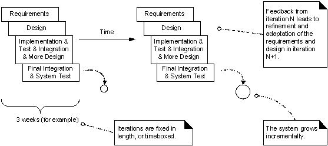
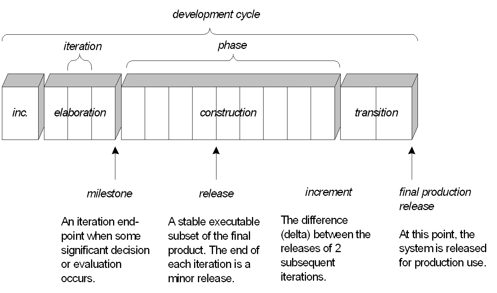

# 软件项目过程模型与规划
{:.no_toc}

* 目录
{:toc}

## 1、解决问题之道

**1.1 基本准则**

> 复杂问题简单化，简单问题流程化，流程问题标准化，标准问题自动化

这是企业规范化管理的基本思想。关键在项目中落地的方法

* 简单化
    - 分解（大事化小，逐步解决；先易后难）
    - 抽象（抓住主要问题，不能舍本求末，舍近求远；理清事物之间的关联、轻重，大处着眼），即建模
        - 常用建模方法：四象限法、九宫格法、VCM（价值链）、BPR（流程重组）
* 流程化
    - 将分解的简单任务按时间，或任务之间的先后关系组织起来
    - 解决问题的通用流程图，则称为模式或过程模型。在软件工程中分两大类
        - 瀑布模型
        - 螺旋模型（迭代、增量、进化）
* 标准化
    - 术语统一
    - 规则统一
    - 方法统一
    - 计量统一
* 自动化
    - 明确授权，自主按流程标准运作
    - 使用IT工具，自动按流程标准运作

**1.2 理解软件本质，了解软件生产特殊性**

软件生产本质是**众智**劳动，且产品范围**弹性大**，展现了智力产品（传统上是艺术品或计谋）与事物产品生产的本质不同

| 问题 | 解决方案 | 备注 |
|:---:|---|---|
|复杂性|解耦设计|工作量与项目规模呈指数关系，且任务完成依赖开发者的上下文知识，即人月不可互换|
|一致性|迭代过程，统一设计语言|用户需要、软件需求、设计、编码...引入的缺陷，常需要在使用场景才发现，导致计划延期|
|易变性|迭代过程，设计模式|产品需求随使用环境变化，如使用者类型、使用者人数会导致需求变化|
|不可见性|迭代过程，定义软件过程的制品|使用者通过多媒体与产品交互，却难以知道内部算法及其系统的复杂。或者说使用者关注结果|
|唯一性|用户为中心|以用户思维思考产品（说易行难）|

例如：同是“图书馆管理系统”，学生作业与实用系统差别巨大。学生作业能解决技术与编程问题，不能解决软件产品生产问题。

## 2、软件项目规划方法与开发模型选择

### 2.1 四象限分析法与用应用

四象限分析法是管理学用于分类事物、分析问题的种方法。它将事物的两个特征变量构成二维矩阵，然后将事物投影到举证上，研究事物分类及其特征的方法，从而找出事物的类型、特诊、主要问题及其解决方案。它简单实用，易于人类理解，得到广泛的应用。学计算机的可认为它是多维数据分类方法的特例。

根据软件本质特征，软件项目可用两个属性表示：

* 复杂度/规模（用人月度量）
    - 极小规模 （1-2个人月，个人短时间能完成）
    - 小规模
    - 一般规模（以48人月为中心 -- 对应8人6月工作量 ）
    - 较大规模 （100 人月）
    - 大规模
* 易变性（用量表表示）
    - 极易变。（缺乏足够用户样本，需求建立在想象、推理基础之上；或用户需求高度不一致）
    - 比较易变。（有类似产品出现，业务流程与技术百花齐放，缺乏稳定商业模式）
    - 易变。（有类似产品参考，需要在基本业务基础上再创新，尝试拓展业务）
    - 比较稳定。（有比较成熟的产品与商业模式，需要业务调整或微创新）
    - 稳定，（产品化软件维护；已有流程、标准化的业务，如财务记账，仓库管理；）

用于研究的软件 **项目开发过程模型**：

* 不需要过程模型
* 瀑布模型
* 螺旋模型
* RAD方法
* 原型方法
* Rational 统一过程模型（RUP）
* Scrum方法
* XP 方法

_注1：过程模型很多，CMM、ITIL、ISO9000、COBIT 等等都是过程模型_。 这些模型用于企业生产、管理与治理。  
_注2：切记!!! 软件项目范围是开发者部分可控的_

请给出分析图与分析结果！

* 如果项目核心是算法问题，规模在 1-2 人月，不需要任何软件过程。直接编程！
* 如果项目风险极大，需采用原型方法验证可行性，并将软件项目规模控制在极小规模。
* ...

### 2.2 基于统一过程的软件项目规划

敏捷、迭代软件过程的要点

上世纪，软件产品规模小，面对是业务规范的企业客户，我们对软件产品的假设是用一个较短的时间，如三个月，可以调查清晰用户对软件产品的需求或要求。  
本世纪，多数软件需要适应个性化的自然人或众多的中小企业，产品的需求不是短时间调查清晰，即需求是开发或使用过程中逐步认清的。因此，上线后不断升级和完善是软件产品基本特征。

用 RUP 的观点：

* 用户为中心（描述用户使用产品的故事）
* 架构为重心（软件产品分解的领域最佳实践）
* 风险驱动（早期暴露风险）

迭代基本特征：

* 每个迭代都是瀑布的工作流程
* 每个迭代产品在增量（制品是可运行的），利于及时交付使用并反馈
* 固定的迭代周期（等量的人月），利于量化团队/个人生产率

RUP迭代周期:

* 明确了不同阶段迭代的里程碑与目标
* 支持 CI/CD 的版本交付
* 为固定项目周期提供了可能

利用软件产品范围的弹性，合理规划范围（20%业务决定80%满意度），使得软件生产按 **固定节奏** 运行，固定迭代周期、固定开发周期、固定升级周期。

**[敏捷软件开发宣言](http://agilemanifesto.org/iso/zhchs/manifesto.html)**

我们一直在实践中探寻更好的软件开发方法，
身体力行的同时也帮助他人。由此我们建立了如下价值观：

- **Individuals and interactions** over processes and tools
- **Working software** over comprehensive documentation
- **Customer collaboration** over contract negotiation
- **Responding to change** over following a plan

## 3、Scrum与敏捷开发支撑工具

推崇以自我管理为核心的协同管理。[Scrum](http://www.scrumcn.com/agile/scrum-knowledge-library/scrum.html)

必须下载阅读的教材：_Scrum and XP from the Trenches_  [英文电子版](https://www.infoq.com/minibooks/scrum-xp-from-the-trenches-2) ,[中文翻译](http://www.infoq.com/cn/minibooks/scrum-xp-from-the-trenches) 

## 4、作业

1、简单题

* 简述瀑布模型、增量模型、螺旋模型（含原型方法），并分析优缺点
    - 从项目特点、风险特征、人力资源利用角度思考
* 简述统一过程三大特点，与面向对象的方法有什么关系？
* 简述统一过程四个阶段的划分准则是什么？每个阶段关键的里程碑是什么？
* 软件企业为什么能按固定节奏生产、固定周期发布软件产品？它给企业项目管理带来哪些好处？

2、实践题（不需要提交）

* 下载腾讯微信企业版PC端，安装腾讯敏捷产品研发平台（TAPD），了解使用 TAPD 的最佳实践（可以写博客获得加分）
    - 比较完善 backlog 支持（树结构）
    - 迭代（sprint）安排
    - 较好的缺陷管理
    - Kanban
    - 统计
* 大作业准备
    - 按大作业要求组件团队、思考项目题目与内容
    - 将团队暂时分为技术研究、业务调研两个部分
        - 技术团队初步确定技术方法，力争做一些技术原型，如 基于 MVC 框架的的用户登陆实现
        - 业务调研团队调查竞争性产品，分析它们的基础、共性业务以及竞争优势

## 参考资料

1. [SCRUM 是一个用于开发和维护复杂产品的框架](http://www.scrumcn.com/agile/scrum-knowledge-library/scrum.html)
2. Henrik Kniberg，[硝烟中的Scrum和XP](https://www.infoq.cn/article/scrum-xp-from-the-trenches)
3. Scoot Ambler, [规范敏捷交付-企业级敏捷软件交付的方法与实践](https://book.douban.com/subject/25741440/)
