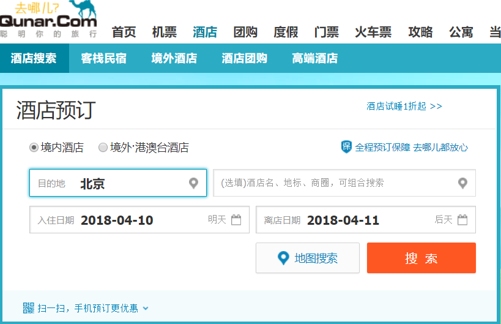

# 用例建模 - 获取需求，编制用例文档

## 1、如何识别、组织需求

* 系统用例识别通常没用唯一答案。合理的用例识别（制作的用例图），通常给团队带来以下利益：
    - 明确系统的业务范围、服务对象（角色）、外部系统与设备
    - 帮助识别技术风险，提前实施关键技术原型公关与学习
    - 易于评估项目工作量，合理规划迭代周期，规划人力需要
* 需求识别步骤
    1. 确定研讨的系统
        - 使用用例图 System框 表示一个待研究的系统
        - 正确命名系统或子系统，例如 Reserve Hotel。 
        - **千万不要将研究的系统的名称起的太泛，如“网上商店”。正确的姿势是“网上书店”，以避免业务空泛问题**
    2. 识别 Actors
        - 识别使用系统的主要参与者（primary actors）/角色(roles)
            - 使用用例图 actor符号 表示，通常放在系统的左边
            - 企业应用可以通过企业组织架构，业务角色与职责识别
            - 互联网应用则必须通过市场分析，确定受众范围
            - **千万不要用“用户”代表系统使用者，以避免过于通用导致缺乏用户体验**。例如，你的系统服务对象是程序员，但你必须明白 c/c++ 程序员、java 程序员、 PHP 程序员之间的相同与不同
        - 识别系统依赖的外部系统
            - 使用用例图 Neighboursystem框 表示用例依赖的外部系统、服务、设备，并使用构造型（Stereotype）识别
                - \<\<system\>\>  例如：Account System（财务系统），教务系统
                - \<\<service\>\>  例如：第三方身份认证、地理信息服务、短信服务等第三方在线服务
                - \<\<device\>\> 或 \<\<sensor\>\> 例如：GPS 等等
            - **要将一些专业功能赋予专业系统。对于 Reserve Hotel 系统，除了订单配送、支付、销售账单由其他专业系统完成外，房源管理都应由独立系统完成，以确保系统的简洁与专业。大而全的软件是软件失败的主要因素之一**
    3. 识别用例（服务）
        - 识别用户级别用例（user goal level）
            - 以主要参与者目标驱动
            - 收集主要参与者的业务事件
            - 必须满足以下准则
                - boss test
                - EBP test
                - Size Test
            - manage 用例。特指管理一些事物的 CRUD 操作，例如管理文件、管理用户等
        - 识别子功能级别的用例（sub function level） 
            - 子用例特征
                - 业务复用。例如：现金支付
                - 复杂业务分解。将业务分解为若干步，便于交互设计与迭代实现
                - 强调技术或业务创新。例如：“识别人脸”，尽管从用户角度是单步操作，但背后涉及技术解决方案是比较复杂的
            - 正确使用用例与子用例之间的关系
                - \<\<include\>\> 表示子用例是父用例的一部分，通常强调离开这个特性，父用例无法达成目标或失去意义！
                - \<\<extend\>\> 表示子用例是父用例的可选场景或技术特征。
                - \<\<include\>\> **箭头指向子用例**；\<\<extend\>\> **箭头指向父用例**。箭头表示的依赖关系！
    4. 建立 Actor 和 Use Cases 之间的关联
        - 请使用 **无方向连线**，表示两间之间是双向交互的协议
* 组织与跟踪需求
    - 用树形结构组织需求
        + system or sub system
            - usecase
                - sub usecase
                - scene 
                - feature    
    - 可以投产的需求或特征
        + 一个迭代可以完成编码与测试
        + 可以独立测试

#### 用例建模练习

* 选择你熟悉的定旅馆在线服务系统（或移动 APP），如绘制用例图。并满足以下要求：
    - 对比 Asg_RH 用例图，请用色彩标注出创新用例或子用例
    - 尽可能识别外部系统，并用色彩标注新的外部系统和服务
* c. 对比两个时代、不同地区产品的用例图，总结在项目早期，发现创新的思路与方法
* d. 请使用 SCRUM 方法，在（任务b）用例图基础上，编制某定旅馆开发的需求 （backlog） 

例如：

## 2、编制用例文档

1. 选择用例文档格式
    - 故事板风格（如练习材料所示） [Asg-RH.pdf](material/Asg_RH.pdf)
    - 用例风格（如教材所示）
        - 简洁格式
        - 非正式格式
        - 正式格式
2. 编写用例文本的基本要点
    - 体现用户使用系统的意图胜于编写详细的操作步骤。业务目标一般难以变化，优化体验是最简单的创新
    - 用户理解的故事胜于技术实现的描绘。使用用户的业务术语，切记不要出现数据库、网络、容器等非业务相关技术术语
    - 关注业务的完成场景胜于功能的枚举。客户需要的完整解决方案，不是一堆有趣的功能特征（尽管客户会关心1-2个有趣功能）
    - 关注业务数据及其变化结果胜于业务过程。即关注任务的输入与输出，软件的特长是数据处理，没有明确数据的业务都是不合适计算机信息系统处理的业务
    - 简洁的语言。 你是用户与程序猿之间的桥梁，你与客户达成的一切需求都是需要程序猿编程的！
3. 用例命名
    - 动词
    - 特殊用例，管理...

## 3、按需求组织生产

需求组织，建议采用 TAPD 需求组织形式：

| ID  | Title | Est | Iter | Imp|
| - | - | - | - | -  |
| 10101| find hotel | 2 | 1 | 5 |
| 10102| &emsp;find city | 2 | 3 | 5 |
| 10103| &emsp;find on map | 10 | 2 | 3 |
| 10104| &emsp;&emsp;GIS API learning | 5 | 1 | 3 |
| 10111| make order | 3 | 1 | 5 |

* 正确编写 Backlog
    * 详细需求请使用文档，需求组织的目标就是建立可合理分解、易于理解、方便迭代实现的 Backlog
    * 如何计算故事点（用例点）
        - 教程 “我们怎样编写产品 backlog” 建立使用人日估计
        - 人日计算依赖经验，常用估算人日依据
            - 页面数（部件数）
            - 报表数
            - API接口数
        - 使用真实数据才能正确估算工作量
            - 模拟数据至少离投产有50%工作量
* 如何决定迭代内容
    - 教程 “我们怎样制定 sprint 计划”
    - 保持轻量，只安排 1-2 个迭代任务的需求
    - 通过“燃尽表”控制进度
* 如何管理团队
    - 阅读教程

### 4、项目文档进度提示

* 1、About（项目规划） 
* 2、Team profile（团队组建）
* 3、Investigation（项目前期调研）
* 4、Vision（项目愿景）
* 5、Product Backlog （产品特性）
* 6、Requirement specification（需求规格说明）
    - 6.1 Usecase Diagram
    - 6.2 **Use Cases（用例）**
* 7、Design（设计）
    - 7.1 UI design
        - XX 用例 UI设计
* 8、生产规范与指南
    - XX 代码规范
* X1 meet_recording
    - inception meeting (yy/mm/dd)
* X2 Tech/Work Report
    - 学号-title

Use Cases 文档风格，每种风格用例都有一个

**经典参考书**

* [编写有效用例（中／英）](http://download.csdn.net/detail/zyg345382708/3094197)
    - 该书特别依赖实践经验， 是一本非常难理解的书