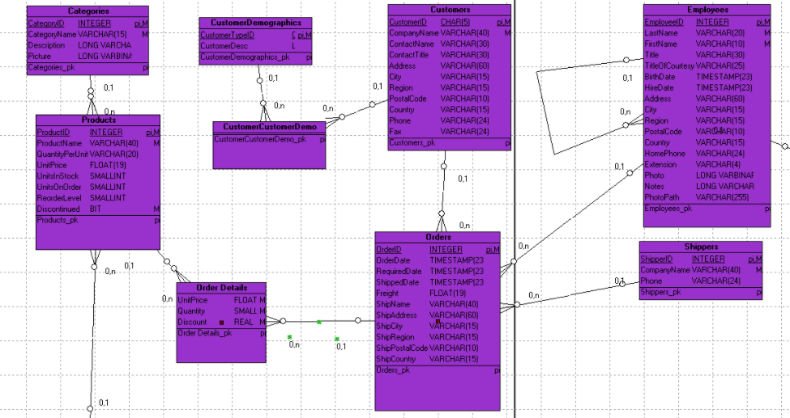

# 领域建模 - 基础

## 1、课程练习

**1.1 简单练习（已知数据）**

学校管理系统要存储下列数据：

（1）数据表及字段

| 实体 | 属性 |
| - | - |
|系|系名，系主任|
|学生|学号，姓名，学生所属系|
|教师|工作证号，姓名，教师所属系|
|研究生|专业方向|
|教授|研究领域|
|课程|课程号，名称，学分|

（2）关系描述

学生每学期要选修若干门课程，每门课有一个考试成绩；某个学期开设的某门课程只有一个任教教师；一个教师只任教一门课；一个教师有能力讲授多门课程，一门课程也可以存在多位教师有能力进行讲授；每个研究生只能跟随一位教授。 

**注**：题目来源于网络，不保证合理性，仅用于练习

* 请采用面向对象方法描述该问题的域领域模型。

**1.2 虚拟世界（熟悉）**

对  Unix 文件系统领域建模

* 文件系统中的常用概念有哪些
    - 文件，目录、链接、卷（volume）、unix socket
* 描述概念之间的关系
* 描述重要属性

**1.3 识别该游戏中的领域对象**

请阅读游戏脚本：

> Priests and Devils

> Priests and Devils is a puzzle game in which you will help the Priests and Devils to cross the river within the time limit. There are 3 priests and 3 devils at one side of the river. They all want to get to the other side of this river, but there is only one boat and this boat can only carry two persons each time. And there must be one person steering the boat from one side to the other side. In the flash game, you can click on them to move them and click the go button to move the boat to the other direction. If the priests are out numbered by the devils on either side of the river, they get killed and the game is over. You can try it in many ways. Keep all priests alive! Good luck!

[玩一下游戏]( ( http://www.flash-game.net/game/2535/priests-and-devils.html ))

1. 列出游戏中涉及的事物（Objects）
2. 对类进行领域建模
3. 识别行为规则与约束

领域模型与参考实现：[Priests and Devils 牧师与恶魔](https://blog.csdn.net/c486c/article/details/79795708)

**1.4 跳板跳水业务建模**

阅读文档：https://zhidao.baidu.com/question/65607627.html

* 给出跳板跳水领域建模
* 该段文字逻辑严密吗？ 

**1.5 使用领域模型学习 VUE**

涉及范围：https://cn.vuejs.org/v2/guide/index.html

# 2、理解领域模型与数据库设计之间的关系

1、 领域建模

* a. 阅读 Asg_RH 文档，**按用例**构建领域模型。 
    - 按 Task2 要求，请使用工具 UMLet，截图格式务必是 png 并控制尺寸
    - 说明：请不要受 PCMEF 层次结构影响。你需要识别实体（E）和 中介实体（M，也称状态实体）
        - 在单页面应用（如 vue）中，E 一般与数据库构建有关， M 一般与 [store 模式](https://cn.vuejs.org/v2/guide/state-management.html) 有关
        - 在 java web 应用中，E 一般与数据库构建有关， M 一般与 session 有关
* b. 数据库建模(逻辑模型/E-R模型)
        - 按 Task 3 要求，给出系统的 E-R 模型（数据逻辑模型）
            - 建模工具 PowerDesigner（简称PD） 或开源工具 [OpenSystemArchitect](http://www.codebydesign.com/) 或 Mysql Workbench 或者 [Navicat](http://www.formysql.com/)
                - 不负责的链接 http://www.cnblogs.com/mcgrady/archive/2013/05/25/3098588.html
        - 导出 Mysql 物理数据库的脚本
        - 简单叙说 数据库逻辑模型 与 领域模型 的异同

如果你不知道数据建模 概念模型 逻辑模型 物理模型 之间区别，请先了解  

* [Navicat 建模操作手册](http://www.formysql.com/uploads/pdf/Navicat_Data_Modeler_PDF_Win.pdf)

# 3、大作业

* 1、About（项目规划） 
* 2、Team profile（团队组建）
* 3、Investigation（项目前期调研）
* 4、Vision（项目愿景）
* 5、Product Backlog （产品特性）
* 6、Requirement specification（需求规格说明）
    - 6.1 Usecase Diagram
    - 6.2 Use Cases（用例）
    - **6.3 Domian Model**
* 7、Design（设计）
    - 7.1 UI design
        - XX 用例 UI设计
    - **7.2 Database design**
        - 7.2.1 用户及权限系统数据库设计
        - 7.2.2 XX子系统数据库设计 
* 8、生产规范与指南
    - XX 代码规范
* X1 meet_recording
    - inception meeting (yy/mm/dd)
* X2 Tech/Work Report
    - 学号-title

大作业要求：
1. 6.3 要求对 6.2 的正式或非正式用例建立 domain model。
2. 7.2 仅要求 E-R 逻辑模型（**如下图，按网上或以前数据库教材格式都不合格**），请用推荐工具制作！！！

【建议阅读】

* 了解名词：DDD (Domain-Driven Design 领域驱动设计) 
