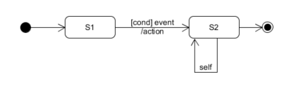

# 领域建模 - 对象状态

## 1、状态建模

**1.1 为什么要状态建模**

领域模型描述了问题域中事物及其之间的关系与量化的约束，我们需要进一步验证模型的有效性与完备性，管理这些事物的生命周期成为有效的方法 - 状态建模。它主要解决以下问题：

* 从实例的角度识别业务事件，完善、优化业务过程的细节，细化业务过程与领域模型
* 给出业务过程合理性与完备性验证
* 为程序开发提供业务规范细节

在软件分析与设计中，状态图是业务逻辑合理性分析的最重要工具。是设计分析师最常用工具！

**1.2 UML 状态建模符号体系**

状态图描述一个 **事物或对象** 受 **事件或消息** 刺激产生 可见的状态（属性/属性组合） 的数据变化。

* 基础符号
    - 起始状态（Initial）
    - 终止状态（Final）
    - 取消/对象取消（Termination）
    - 状态（State）
    - 变迁（Transform），含条件（Condition）、事件（Event）和事件处理动作（Action/Handler）
* 扩展符号
    - 复合状态
    - 信号

绘图注意事项：

* 必须有起始状态，通常有终止和取消状态
* 状态命名要用名词短语、动词过去时或正在进行时等具有延续性的词汇
* 在需求分析过程中，尽可能不涉及动作

**1.3 状态建模**

应用场景：

* 需求建模。 与客户讨论关键事物的变化过程。 进一步细化 用例图 或 用例场景。
* OOD/P 软件设计。 关键数据的变化；表达状态机；状态机模式（GOF）

工作步骤：

1. 确定研究对象
    - 这是最难的！系统作为一个对象？所有对象？
    - 通常是客户关注的业务交易实体，如订单，凭证等
2. 识别状态集合 
    - I， F， S={S0...Sk}
    - 状态不一定是门的开或关闭这样简单属性，可能是属性复杂的组合
    - 事物中包含的 mode 和 state 属性
3. 识别事件和变迁条件
4. 合理性、完整性检查与逻辑分析
    - 终点的可达性
    - 悬挂状态
    - 循环分析（死循环条件与风险）
    - 路径分析（最短路径、关键路径、平均距离）

**1.4 案例研究**

1）simple digital watch

> A simple digital watch has a display and two buttons to set it, the A button and the B button. The watch has two modes of operation, display time and set time. In the display time mode, hours and minutes are displayed, separated by a flashing colon.
>  
> The set time mode has two sub-modes, set hours and set minutes. The A button is used to select modes. Each time A is pressed, the mode advances in sequence: display, set hours, set minutes, display etc. Within the sub-modes, the B button is used to advance the hours or minutes once each time it is pressed. Buttons must be released before they can generate another event.

2）对 “Priests and Devils” 提出新的需求，在游戏中添加Help功能，用户点help，就自动完成目标移动。

> 提示：游戏初始状态为[PPPDDD]B-[]，终止状态[]-B[PPPDDD]，其中[]表示河岸、P表示Priest、D表示Devil、B表示Boat。

3）旅店的房间状态建模

* 状态集合 S= { 可用，维护中，锁定，预定，使用中 }
* 常见事件 E = { 电话预定，网上预定，支付，入住，取消预定，换房 ... ，退房 }
* 会出现 取消状态 吗？
* 检查你的订房系统分析，不能处理上述哪些事件？请完善相关用例图和文本！

**1.5 与活动图的区别**

几乎相同的符合形状与元素？

## 2、 面向资源的设计 - API 设计指南

**2.1 为什么要掌握面向资源的设计**

如果你熟悉领域模型的获取（例如：你完成了 Find Hotel 用例的领域模型和数据库设计），又计划用 VUE、React 或 Angular 做前端，面向资源的设计的设计就是你的大杀器了！

* 实践 "API First" 的设计思想，实现前后端分离开发
* 实践 Test 驱动（TDD），实现边开发边测试
* 学习设计规范的 RESTful API，达到生产级水平

你需要掌握的知识：

* HTTP 协议基础
* 标准：[Google API 设计指南 - 面向资源的设计](https://segmentfault.com/a/1190000008459700)
* 工具：API 设计工具，推荐 Blueprint [apiary](https://apiary.io/), [swagger editor](http://editor.swagger.io/#/), [postman](https://www.getpostman.com/), [zpizza](https://apizza.net/)
* 测试工具： curl

案例研究：

* [GitHub API v3 \| GitHub Developer Guide](https://developer.github.com/v3/),[中文翻译](https://zhuanlan.zhihu.com/p/35555758)

**2.2 资源**

建议先阅读 [RESTful HTTP in practice](https://www.infoq.com/articles/designing-restful-http-apps-roth) [中文翻译](https://www.infoq.com/cn/articles/designing-restful-http-apps-roth?utm_source=infoq_en&utm_medium=link_on_en_item&utm_campaign=item_in_other_langs)

> 资源是REST中最关键的抽象概念，它们是能够被远程访问的应用程序对象。一个资源就是一个标识单位，任何可以被访问或被远程操纵的东西都可能是一个资源。

[不给盗链]请阅读原文

Figure 1: Example analysis model

分析模型（课程教程是领域模型、或对象模型）是识别资源的一个非常好的“切入点”。资源设计的主要驱动力是网络因素而不是对象模型。任何重要的资源都应该能够通过一个唯一的标识被访问。RESTful HTTP使用URI来识别资源。

**2.3 实例**

Gmail API 服务实现了 Gmail API 并提供了 Gmail 的大部分功能。它有以下资源模型：

* Gmail API 服务：gmail.googleapis.com
* 用户集合：users/*。每个用户有以下资源
    - 消息集合：users/\*/messages/\*
    - 线程集合：users/\*/threads/\*
    - 标签集合：users/\*/labels/\*
    - 修改历史集合：users/\*/history/\*
    - 代表用户资料的资源：users/\*/profile
    - 代表用户设置项的资源：users/\*/settings

**2.4 主要概念**

**主资源**：领域模型是交易实体或主要对象。例如 Hotels，Orders, Customers。 通常是复数！例如：

    https://api.xx.com/users

**资源实例**：一个资源的个体，由资源ID识别。例如：

    https://api.xx.com/users/007-u1

**子资源**：主资源拥有的资源。通常由分析模型导航关系决定，导航范围控制在两级以内。例如：

    https://api.xx.com/users/007-u1/orders

**资源CRUD操作**

使用 HTTP 操作实现:

* GET：从服务器取出资源（一项或多项）。
* POST：在服务器新建一个资源。
* PUT：在服务器更新资源（客户端提供改变后的完整资源）。
* PATCH：在服务器更新资源（客户端提供改变的属性）。
* DELETE：从服务器删除资源。

如果要适应多种语言，请**仅使用 GET 和 POST**

**资源缓存**

当 GET 返回码 304 是表示客户端支持缓存的。在做大量数据传输时，要充分利用缓存。自己研究 heads

**资源过滤操作**

例如：

    https://api.xx.com/hotels?city=?&start-date=?&...

**资源投影操作**

例如：

    https://api.xx.com/hotels?projection=name,star,city,desc

**资源分页操作**

例如：

    https://api.xx.com/hotels?page=2&per_page=100

**资源跨域操作**

必须带 callback 参数，返回 jsonp 格式数据。例如：

    https://api.xx.com/hotels?callback=callbackproc

**API 版本管理**

* 采用版本识别 url。 例如 https://api.xx.com/v1/hotels?...
* 采用 heads 发送版本信息

**App 应用认证管理**

认证访问 API 的程序是合法的

* http 基本认证
* url 中发送 appcode 参数

**2.5 定旅馆案例研究**

...

**2.6 使用设计工具**

为什么要使用工具？

* 支持 API 文档化编写，同时生成服务端和客户端程序原型
* 支持双向 mock 服务
    - 生成可视化 API 客户端，集成测试服务端
    - 作为 mock 服务端，支持客户端开发
* 支持 API 快速迭代

如何有效使用这些工具？

* 见同学的博客

## 3、个人作业

练习资源：[Asg-RH.pdf](material/Asg_RH.pdf)

使用 **UMLet** 建模

* 1、使用类图，分别对 Asg_RH 文档中 Make Reservation 用例以及 Payment 用例开展领域建模。然后，根据上述模型，给出建议的数据表以及主要字段，特别是主键和外键
    - 注意事项：
        - 对象必须是名词、特别是技术名词、报表、描述类的处理；
        - 关联必须有多重性、部分有名称与导航方向
        - 属性要注意计算字段
    - 数据建模，为了简化描述仅需要给出表清单，例如：
        - Hotel（ID/Key，Name，LoctionID/Fkey，Address.....）
* 2、使用 UML State Model，对每个订单对象生命周期建模
    - 建模对象： 参考  Asg_RH 文档， 对 Reservation/Order 对象建模。
    - 建模要求： 参考练习不能提供足够信息帮助你对订单对象建模，请参考现在 定旅馆 的旅游网站，尽可能分析围绕订单发生的各种情况，直到订单通过销售事件（柜台销售）结束订单。

## 4、团队作业

* 1、**About（项目规划）** 
* 2、Team profile（团队组建）
* 3、Investigation（项目前期调研）
* 4、Vision（项目愿景）
* 5、Product Backlog （产品特性）
* 6、Requirement specification（需求规格说明）
    - 6.1 Usecase Diagram（用例图）
    - 6.2 Use Cases（用例+活动图）
    - 6.3 Domian Model（领域模型）
    - **6.4 State Model（状态模型）**
* 7、Design（设计）
    - 7.1 UI design
        - XX 用例 UI设计
    - 7.2 Database design
        - 7.2.1 用户及权限系统数据库设计
        - 7.2.2 XX子系统数据课设计 
        - 7.2.x 第三方数据评审结果
    - **7.3 API 设计**
* 8、生产规范与指南
    - 8.1 XX 代码规范
    - **8.2 REST API 设计规范**
* X1 meet_recording
    - inception meeting (yy/mm/dd)
* X2 Tech/Work Report
    - 学号-title

团队作业要求：

1. 1 检查第一个迭代内容与组织，规划第二个迭代
2. 6.4 需要简述建模理由和方法
3. 7.3 仅需要在线链接。链接到你发布的 API
4. 8.2 可以参考网上 REST API 设计规范，请重新按自己的设计组织，并不断更新

