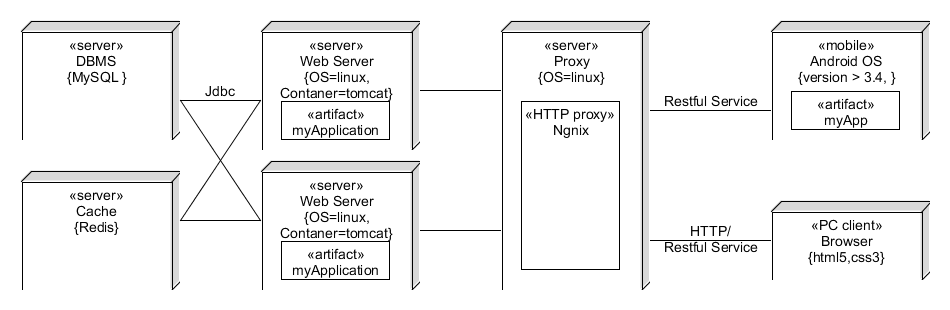

# 架构建模 - 云时代的架构实践

## 1、软件架构的概念

### 1.1 软件架构定义

> An architecture is the set of significant decisions about the organization of a software system, which describe the selection of the structural elements and their interfaces by which the system is composed，and their behavior as specified in the collaborations among those elements

软件架构就是把系统分解为一些部件，描述这些部件的职责及它们之间的协作行为。

### 1.2 软件架构模式

> An architectural style guides the organization of these elements and their collaborations to solve common problems of the specific domain.

架构模式（**style**）是 **特定领域** 常见问题的解决方案，例如：

* 信息系统领域
    - 多层架构，经典的三层架构是：
        - 表示层（Presentation Layer）
            - Models，Views，Controllers
            - State Management 
        - 业务层（Business Layer）/服务层（Service Layer）
            - Transacton（交易）
            - Query（查询）
        - 持久化层（Persistent Layer）/ 数据访问层（Data Access Layer/DAO）
            - CRUD（实体的四种操作）
            - ORM（实体与关系映射）
* 结构化设计领域，如 Unix
    - 模块化架构
        - 模块结构树
            - 父模块称为控制
            - 各子模块分别完成输入、处理、输出
        - 自顶向下分解，自下而上开发
* 消息服务领域
    - 消息过滤， 典型产品 web 框架
    - 数据黑板， 典型产品 Redis
    - 消息路由， [6 种基本模式](http://www.rabbitmq.com/getstarted.html)， 典型产品 AMQP 产品系列，例如 RabbitMQ 

### 1.3 了解一些常用架构模式优势

* 软件结构是业界长期最佳实践的总结
    - 选择 优于 创造
    - 理解结构 优于 硬搬框架
* 理解系统 big picture
    - 语言无关
* 评估产品结构的合理性
    - 评价模块的内聚性
        - 聚焦？ 一句话描述模块的职责
    - 评价模块间耦合性
        - 有序？ 消息流（依赖）是否单向

### 1.4 架构（architecture styles）与应用程序框架（application frameworks）

框架是特定语言和技术的架构应用解决方案。例如 Java Spring web framework，它包含了 Java 开发 web 应用的各种业务场景的具体解决方案。例如：

* Core DI & IOC，自动化管理层间的依赖
* Core AOP, 隐式业务事务管理
* MVC 表示层组件（集成了多种视图解决方案，主推 thymeleaf）
* ORM 持久层组件（集成了多种持久化解决方案，主推 hibernate）
* spring cloud 云服务的解决方案（集成了多种微服务架构实现解决方案，主推 Netflix）
* 其他包括各种消息服务解决方案

spring web 开发有几万页文档，但学习曲线悠长平稳，这是其他语言如 Python 等无法企及的。你可能已发现：

* 框架是具体语言和技术相关的
* 框架是一种或多种架构的组合的实现
* 框架是集成了你的代码和多种第三方解决方案的工具，让你聚焦 **业务逻辑代码** 而 **不是技术实现**

面对几万页文档，完全阅读是不可能的！唯一的方法就是在架构的指引下，集合一些案例代码，找你需要的内容。一些常见问题：

* 官方代码因为代码简洁的需要破坏架构。解决方案，看实际应用代码结构，并在应用中按软件架构准则调整。
* 使用框架的难点不是编码，而是产品选择与配置设计。解决方案，在迭代早期用实际应用测评

## 2、架构的设计

### 2.1 软件架构的业务背景

软件架构是由 IBM 推动的技术概念，对应的职业就是软件架构师。 在19世纪末，20世纪初，IBM 面临这样的业务背景，“麦当劳”大叔这类客户希望 IBM 帮助它建立全球零售系统的规划，以满足：

* 保护用户投资，避免技术、设备升级带来的巨大浪费
* 支持业务的扩展带来的业务压力，避免频繁修改软件（软件成本 \>\> 设备成本）

 IBM 觉得有必要建立一套规范的软件工程方法描述用户的高层需求，让软件系统支持的业务系统可持续发展。这既是高端咨询的大生意，也可以乘机销售自己的产品，完善产品生态，抑制竞争对手。 这符合 IBM 一贯的定位 – 基础设施供应商（为淘金人提供镐与牛仔裤）。

 IBM 专家面对复杂业务系统的复杂性而客户关注结果的矛盾，提出了多视角分析问题场景分析法，常见的场景如：

* 某零售商有100家零售店，预计3-5年后全球业务增长100倍，给出保护现有投资并能应对未来增长的技术方案。
* 某电信公司 XX 服务在线系统现有客户 100 万，预计每年增长 20% ，设计动态扩容方案。

### 2.2 架构设计方法论

针对信息系统，Rational Software 的专家在前人的基础上提出 `Rational 4+1` 架构建模方法论。科普入门文章 [运用RUP 4+1视图方法进行软件架构设计](https://www.ibm.com/developerworks/cn/rational/06/r-wenyu/)

Philippe Kruchten提出的4+1视图方法：

该方法用不同架构视图承载不同的架构设计决策，支持不同的目标和用途：

* 场景视图：对业务进行分析，提出架构需要满足的需求。
* 逻辑视图：当采用面向对象的设计方法时，逻辑视图即对象组织模型，通常用包图表示。
* 物理视图：描述软件如何映射到硬件，反映系统设备或制品在分布方面的设计，通常用部署图表示。
* 开发视图：描述软件在开发环境下的静态组织，通常用包或对象之间的交互顺序图表示。
* 处理视图：描述系统的并发和同步方面的设计，通常用软件制品之间的交互顺序图表示。

本课程仅讲述利用业务场景视图获取架构需求编写需求文档；利用包图描述类与包的组织；利用部署图表示产品的实施与部署。

### 2.2 架构需求的获取

**1、利益相关人及其关注点分析**

从架构设计的角度，利益相关人分为三类：

* 产品经理与客户：安全、日志、易用、健壮 ... ...
* 开发者：开发快速、模块化（可复用, 可管理）、可扩充、互操作（可移植）、易测试、易理解、国际化 ... ...
* 运维者：部署自动化、可伸缩、易用性、可靠性、鲁棒性、安全性 ... ...

**2、如何编写架构需求**

架构需求依然按 `FURPS+` 模型组织，重点是 `URPS+`。所以软件架构又称为非功能驱动的设计，又称 `FDD` (Feature-driven development)

详细格式参见教材第七章 Supplementary Sepcification

### 2.3 逻辑架构设计

见课件。三层模型（表示层、业务层、持久化层）

**1、层与分区准则**

* 表示层：一般按用户角色划分分区，以点餐系统为例：用户点餐子系统、餐厅管理子系统、餐厅厨房管理子系统、运维服务子系统等
* 业务层: 一般按业务功能服务划分分区，以点餐系统为例：用户管理模块、菜品管理模块、订单管理模块、配餐管理模块、餐厅服务行为管理、餐厅管理等
* 持久化层：按核心交易实体管理（资源管理），以点餐系统为例：用户、菜品、订单等等的 CRUD

**2、逻辑设计的好处**

* 程序员
    - 每个层或包的职责是清晰的，模块化并可扩展的。系统分析的每个类会分明确的放置；
    - 提供了隐式的程序复用准则；
    - 每个层涉及的技术是明确的。这使得程序员可以通过快速培训上岗；
    - 通过依赖估计项目变化产生的工作量；
    - 开发次序和重要性是明确的。领域模型、基础模块（用户和基础数据的DTO和Service必须优先开发与测试），减少这些模块的错误，特别是领域模型设计失误，是项目成功的关键；
    - 并行开发支持。利用前后端分离，实现并行开发
* 产品经理
    - 知道系统的模块划分，以及业务扩展能力

**3、包的命名规则**

* 一般规则：com.yourcompany.system.subsystem.layername 例如：com.me.filmorder.onlinesale.repos
* 实用程序或辅助类： com.yourcompany.system.commons.layername.subclass 例如： com.me.fileorder.commons.frameworks.message

**4、实际应用包的组织**

参考不同语言和技术的框架目录结构

### 2.5 物理视图设计

显然，架构逻辑设计仅对程序员是友好的，但运维和产品经理并不太感兴趣。 出于对性能、伸缩性、可靠性、可维护（监控）的需要，团队需要知道系统的物理部署，并了解这些需求的实现，以及对编程的影响。

**1、部署图的元素**

* artifacts：编程项目编译后生成的程序包。 如 jar，war 等。 可能你说我的项目只有一个制品？ 呵呵 ... 项目不够大，业务不够复杂，继续努力
* components：具有特定接口的功能部件。一个 artifacts 可以包含多个 components，一个 component 也可以涉及多个制品
* Device，Host，Execute Environment ：统称容器或节点，\<\<container catalog\>\> 表示分类 {key：value，...} 表示属性描述
* 关联：表示通讯模式或协议

**2、案例研究**

一个简单的多层（multi-ties）web 应用部署

如何解释部署与应用场景的关系才是最重要的，例如：

* 程序员会问，负载均衡会影响编程吗？ 会！ web 编程 session 要放在缓存。 所有需要一个 session 一致的解决方案。用 Redis 共享！
* 客户会问，当用户增加时怎么办？只需要增加 web 服务器就能成倍增加性能。当然，需要用 AB 等工具压一个曲线给客户！
* 为什么要用缓存服务， 当然！未来的瓶颈一定在 DBMS 服务器，应用中读操作占 90% 以上，可提高三倍的业务量。

以上，解决了性能、伸缩性等问题

### 2.6 架构文档编写

* 教材第38章，讲述了部署图
* 教材第39章，讲述了 N+1 视图架构文档的编写，详细案例见 39.3

## 3、云时代对软件架构的思考

本部分收集了软件架构对程序设计的影响。

**1、云应用程序体系架构的作用**

[Azure 应用程序体系结构指南](https://docs.microsoft.com/zh-cn/azure/architecture/guide/)

通过该文档，你应该了解：

* 架构风格的核心作用是什么？
* 云服务架构关注了哪些问题？
* 云服务架构的读者（客户）是谁？
* 架构设计涉及的内容有哪些？

**2、云服务的两种典型架构风格**

[微服务体系结构样式](https://docs.microsoft.com/zh-cn/azure/architecture/guide/architecture-styles/microservices)

[CQRS 体系结构样式](https://docs.microsoft.com/zh-cn/azure/architecture/guide/architecture-styles/cqrs)

通过上述文档，你应该了解：

* 微服务架构的使用场景？
* 不同风格不是互斥的，而是相容的。例如：在微服务中使用读写分离是解决高并发，如100万以上用户的基本手段

**3、CQRS 与 事件溯源**

[命令和查询责任分离 (CQRS) 模式](https://docs.microsoft.com/zh-cn/azure/architecture/patterns/cqrs)

[事件溯源模式](https://docs.microsoft.com/zh-cn/azure/architecture/patterns/event-sourcing)

[什么是 Flux 架构？](https://juejin.im/entry/577f06e62e958a0054af5a2a)

通过上述文档，你应该了解：

* 事件溯源 与 CQRS 是一对常见的组合
* Flux 架构设计者如何思考设计模式改进 MVC 状态管理
* 架构风格与设计模式的区别？

参考阅读：Martin Fowler [CQRS](https://martinfowler.com/bliki/CQRS.html)

## 4、团队作业

https://sysu-sasd-project.github.io/dashboard/
 
* Supplementary Requirements 参见教材 第七章 7.4
    - 请按格式书写
* Software Architecture Document 参见教材 第三十九章 39.3
    - 仅需要 架构问题、解决方案说明、逻辑视图、物理视图 四个部分

## 5、个人作业

* 描述软件架构与框架之间的区别与联系
* 以你的项目为案例
    - 绘制三层架构模型图，细致到分区
    - 结合你程序的结构，从程序员角度说明三层架构给开发者带来的便利
* 研究 VUE 与 Flux 状态管理的异同

